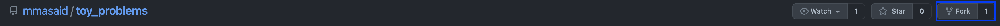

# toy_problems

## _Voice Toy Problems_

`
This repo to improve the team problem solving skills
`

[](https://nodesource.com/products/nsolid)

[](https://travis-ci.org/joemccann/dillinger)

## Setup

1. Fork the repository

   

2. Clone the forked repository from your profile
3. Configure a remote for a fork by running the following command

   ```sh
    git remote add upstream git@github.com:mmasaid/toy_problems.git
   ```

4. Fetch and merge for the daily problem!

```sh
  git fetch upstream
  git merge upstream/main
```

## Steps

1. Fork the repository
2. Clone the forked repository from your profile
3. Configure a remote for a fork by running the following command

   ```sh
    git remote add upstream git@github.com:mmasaid/toy_problems.git
   ```

4. Fetch and merge for the daily problem!

```sh
  git fetch upstream
  git merge upstream/main
```

## Team

`- Mohammad Masaid`
